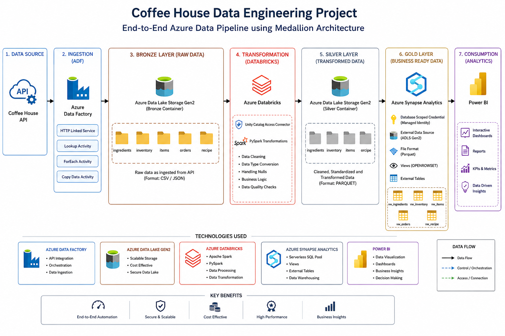
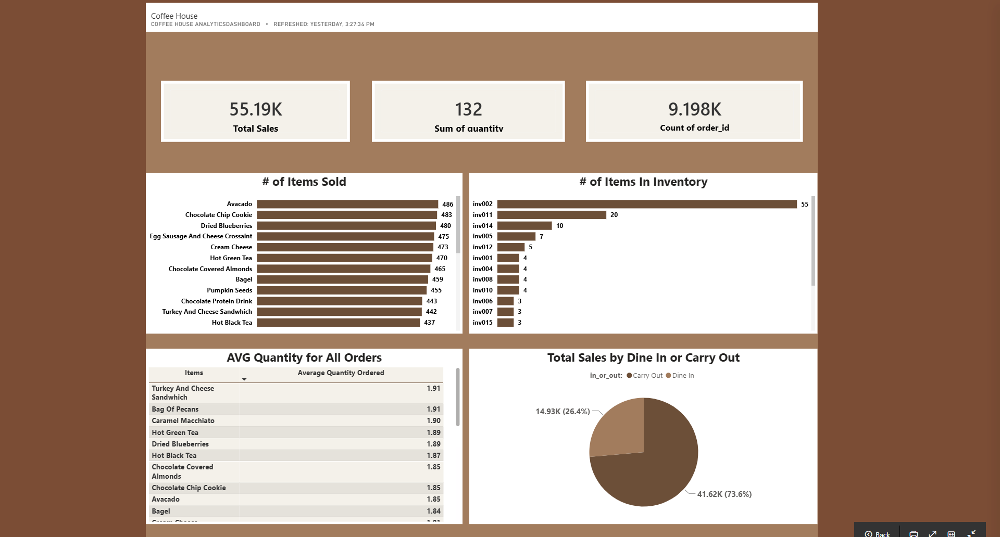

# ☕ Coffee House Data Engineering Project
### End-to-End Azure Data Engineering Pipeline with Medallion Architecture


---

# 📖 Project Overview

This project demonstrates an end-to-end Azure Data Engineering solution using the **Medallion Architecture (Bronze → Silver → Gold)**.

The objective of this project was to build a modern cloud data platform that:

- Extracts data from an API
- Ingests raw data into Azure Data Lake Storage Gen2
- Transforms and cleans the data using PySpark in Azure Databricks
- Creates analytical views and external tables in Azure Synapse Analytics
- Visualizes business insights using Power BI dashboards

---

# 🏗️ Architecture

<p align="center">
  
</p>

<p align="center">
  <em>Figure 1: End-to-End Azure Data Engineering Pipeline using Medallion Architecture (Bronze → Silver → Gold).</em>
</p>

---

# 🏛️ Data Architecture

This project follows the Medallion Architecture:

## Bronze Layer (Raw Data)

Purpose:
- Store raw API data
- Preserve original source data
- Enable historical reprocessing

Technology:
- Azure Data Factory
- Azure Data Lake Storage Gen2

---

## Silver Layer (Transformed Data)

Purpose:
- Data cleansing
- Schema standardization
- Data quality improvements
- Business transformations

Technology:
- Azure Databricks
- Apache Spark
- PySpark
- Azure Data Lake Storage Gen2

---

## Gold Layer (Business Ready Data)

Purpose:
- Reporting datasets
- Analytics-ready tables
- Business consumption layer

Technology:
- Azure Synapse Analytics
- External Tables
- Views
- OPENROWSET()

---

# 🛠️ Technologies Used

| Service | Purpose |
|---------|----------|
| Azure Resource Group | Resource Management |
| Azure Data Factory | Data Ingestion and Orchestration |
| Azure Data Lake Storage Gen2 | Data Storage |
| Azure Databricks | Data Transformation |
| Unity Catalog Access Connector | Secure Data Lake Access |
| Apache Spark | Distributed Data Processing |
| PySpark | Data Engineering Transformations |
| Azure Synapse Analytics | Data Warehouse and Analytics |
| Power BI | Reporting and Dashboarding |

---

# 🚀 Project Implementation

# Step 1: Created Azure Resources

Created the following Azure resources:

- Resource Group
- Azure Data Factory
- Azure Data Lake Storage Gen2
- Azure Databricks Workspace
- Unity Catalog Access Connector
- Azure Synapse Analytics Workspace

---

# Step 2: Data Ingestion with Azure Data Factory

The source data was extracted from an API using:

### Linked Services
Configured:

- HTTP Linked Service
- Azure Data Lake Storage Linked Service

### ADF Pipeline Activities

#### Lookup Activity
Used to retrieve metadata and dynamically process multiple datasets.

#### ForEach Activity
Iterated through files and API endpoints dynamically.

#### Copy Data Activity
Copied data from the API into the Bronze container.

### Result

```text
API
 ↓
ADF Pipeline
 ↓
Bronze Container
```

---

# Step 3: Bronze Layer

Raw data was loaded into Azure Data Lake Storage Gen2.

Container Structure:

```text
bronze/
├── ingredients/
├── inventory/
├── items/
├── orders/
└── recipe/
```

Purpose:

- Preserve source data
- Maintain raw history
- Support data reprocessing

---

# Step 4: Data Transformation with Azure Databricks

Created an Azure Databricks workspace and configured secure access using:

### Unity Catalog Access Connector

This connector allowed Databricks to securely read and write data in ADLS Gen2.

---

# PySpark Transformations

Performed transformations including:

- Data type conversions
- Null handling
- Data cleansing
- Standardized column names
- Date formatting
- Schema enforcement
- Data quality validation
- Data normalization

---

# Step 5: Silver Layer

Transformed data was written back into Azure Data Lake Storage Gen2.

Container Structure:

```text
silver/
├── ingredients/
├── inventory/
├── items/
├── orders/
└── recipe/
```

Purpose:

- Clean datasets
- Standardized schemas
- Analytics-ready data

---

# Step 6: Azure Synapse Analytics (Gold Layer)

Created a Synapse workspace and connected it to the Silver container.

---

# Database Scoped Credential

Created a Database Scoped Credential using:

- Managed Identity Authentication

This allowed Synapse to securely access files stored in ADLS Gen2.

---

# External Data Source

Configured:

- External Data Source
- Managed Identity Authentication

---

# External File Format

Created:

```sql
CREATE EXTERNAL FILE FORMAT ParquetFileFormat
WITH (
    FORMAT_TYPE = PARQUET
);
```

---

# Views using OPENROWSET()

Created SQL views using:

```sql
SELECT *
FROM OPENROWSET(
    BULK 'https://storageaccount.blob.core.windows.net/silver/orders/',
    FORMAT = 'PARQUET'
) AS rows;
```

---

# External Tables

Created external tables on top of the Silver layer datasets to expose business-ready data for reporting and analytics.

---

# Gold Layer

```text
Gold Layer
├── vw_ingredients
├── vw_inventory
├── vw_items
├── vw_orders
└── vw_recipe
```

Purpose:

- Reporting
- Self-service analytics
- Power BI integration
- Business intelligence

---

# 📊 Power BI Dashboard

<p align="center">
  
</p>

<p align="center">
  <em>Figure 2: Interactive Power BI dashboard built on top of Azure Synapse Gold Layer datasets.</em>
</p>

### View the Interactive Dashboard

👉 https://app.powerbi.com/groups/me/dashboards/862b0383-a9d0-4559-8988-4c5efd928c69?experience=power-bi

---

```markdown
## Power BI Dashboard

<p align="center">
  
</p>

<p align="center">
  <em>Figure 2: Interactive Power BI dashboard built on top of Azure Synapse Gold Layer datasets.</em>
</p>

---

# 📂 Project Structure

```text
CoffeeHouse-Project
│
├── data/
│
├── adf/
│   ├── pipelines
│   └── linked-services
│
├── databricks/
│   ├── bronze_to_silver
│   └── pyspark_notebooks
│
├── synapse/
│   ├── credentials.sql
│   ├── external_sources.sql
│   ├── file_formats.sql
│   ├── views.sql
│   └── external_tables.sql
│
├── powerbi/
│   └── dashboard.pbix
│
├── images/
│   └── powerbi-dashboard.png
│
└── README.md
```

---

# 🎯 Skills Demonstrated

- Azure Data Factory
- API Data Ingestion
- Linked Services
- Lookup Activity
- ForEach Activity
- Copy Data Activity
- Azure Data Lake Storage Gen2
- Azure Databricks
- Unity Catalog
- Apache Spark
- PySpark
- Data Transformation
- Medallion Architecture
- Azure Synapse Analytics
- OPENROWSET()
- External Tables
- Database Scoped Credentials
- Managed Identity
- Power BI
- Cloud Data Engineering
- End-to-End ETL Pipeline

---

# 📈 Business Value

This project demonstrates how to build a scalable, cloud-native data platform that:

✔️ Automates data ingestion from APIs  
✔️ Stores raw and transformed data efficiently  
✔️ Implements modern Medallion Architecture principles  
✔️ Enables analytics-ready datasets  
✔️ Supports self-service reporting with Power BI  
✔️ Demonstrates production-style Azure Data Engineering workflows

---

# 👨‍💻 Author

**Niam Dickerson**

Data Engineer | Azure | Databricks | PySpark | Synapse Analytics | Power BI

GitHub: https://github.com/niampython
LinkedIn: https://www.linkedin.com/in/niamdickerson/
